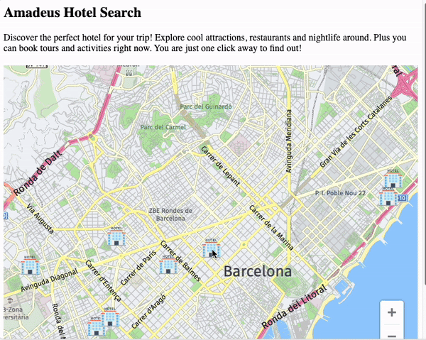

# Map with Hotels, Points of Interests and Tours & Activities



In this prototype we demonstrate POIs and tours for a chosen hotel on the map, using the following APIs:
- [Hotel Search](https://developers.amadeus.com/self-service/category/hotel/api-doc/hotel-search): shows hotels on the map
- [Points of Interest](https://developers.amadeus.com/self-service/category/destination-content/api-doc/points-of-interest): shows POIs around the hotel
- [Tours and Activities](https://developers.amadeus.com/self-service/category/destination-content/api-doc/tours-and-activities/api-reference): shows bookable tours and activities around the hotel
- [HERE Maps](https://developer.here.com/): displays a map with markers and text bubbles

You can directly view the [demo](https://hotel-search-map.azurewebsites.net/) of the prototype and refer to the [blog article](https://developers.amadeus.com/blog/hotel-search-project-python) well.

## How to run the project via Docker (recommended)

Build the image from the Dockerfile. The following command will

```sh
make
```

The container receives your API key/secret from the environment variables.
Before running the container, make sure your have your credentials correctly
set:

```sh
export AMADEUS_CLIENT_ID=YOUR_AMADEUS_API_KEY
export AMADEUS_CLIENT_SECRET=YOUR_AMADEUS_API_SECRET
export HERE_API_KEY=YOUR_HERE_API_KEY
```

Finally, start the container from the image:

```
make run
```

At this point you can open a browser and go to `https://0.0.0.0:8000`.

Note that it is also possible to run in detached mode so your terminal is still
usable:

```
make start
```

Stop the container with:

```
make stop
```

## How to run the project locally

Clone the repository.

```sh
git clone https://github.com/amadeus4dev/amadeus-hotel-search-pois-tours-django.git
cd amadeus-hotel-search-pois-tours
```

Next create a virtual environment and install the dependencies.

```sh
python -m venv venv
source venv/bin/activate
pip install -r requirements.txt
```

For authentication add your API key/secret to your environmental variables.

```sh
export AMADEUS_CLIENT_ID=YOUR_API_KEY
export AMADEUS_CLIENT_SECRET=YOUR_API_SECRET
export HERE_API_KEY=YOUR_HERE_API_KEY
```

You can easily switch between `test` and `production` environments by setting:

```
export AMADEUS_HOSTNAME="test" # an empty value will also set the environment to test
```

or

```
export AMADEUS_HOSTNAME="production"
```

> Each environment has different API keys. Do not forget to update them!

Finally, run the Django server.

```sh
python amadeus_demo/manage.py runserver
```

Finally, open a browser and go to `https://127.0.0.1:8000`

## License

This library is released under the [MIT License](LICENSE).

## Help

You can find us on [StackOverflow](https://stackoverflow.com/questions/tagged/amadeus) or join our developer community on
[Discord](https://discord.gg/cVrFBqx).
